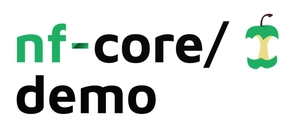
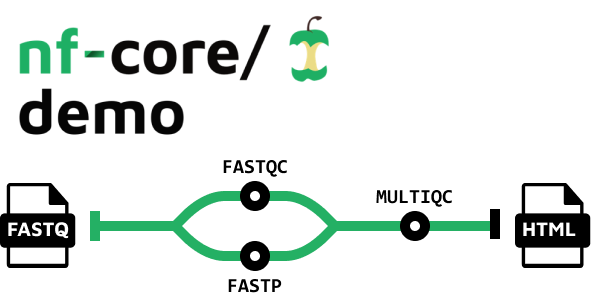

<h1>
  <picture>
    <source media="(prefers-color-scheme: dark)" srcset="docs/images/nf-core-demo_logo_dark.png">
    
  </picture>
</h1>

[](https://github.com/nf-core/demo/actions/workflows/ci.yml)
[](https://github.com/nf-core/demo/actions/workflows/linting.yml)[](https://nf-co.re/demo/results)[](https://doi.org/10.5281/zenodo.12192442)
[](https://www.nf-test.com)

[](https://www.nextflow.io/)
[](https://docs.conda.io/en/latest/)
[](https://www.docker.com/)
[](https://sylabs.io/docs/)
[](https://cloud.seqera.io/launch?pipeline=https://github.com/nf-core/demo)

[](https://nfcore.slack.com/channels/demo)[](https://twitter.com/nf_core)[](https://mstdn.science/@nf_core)[](https://www.youtube.com/c/nf-core)

## Introduction

**nf-core/demo** is a simple nf-core style bioinformatics pipeline for workshops and demonstrations. It was created using the nf-core template and is designed to run quickly using small test data files.



1. Read QC ([`FASTQC`](https://www.bioinformatics.babraham.ac.uk/projects/fastqc/))
2. Adapter and quality trimming ([`SEQTK_TRIM`](https://github.com/lh3/seqtk))
3. Present QC for raw reads ([`MULTIQC`](http://multiqc.info/))

## Usage

> [!NOTE]
> If you are new to Nextflow and nf-core, please refer to [this page](https://nf-co.re/docs/usage/installation) on how to set-up Nextflow. Make sure to [test your setup](https://nf-co.re/docs/usage/introduction#how-to-run-a-pipeline) with `-profile test` before running the workflow on actual data.

First, prepare a samplesheet with your input data that looks as follows:

`samplesheet.csv`:

```csv
sample,fastq_1,fastq_2
SAMPLE1_PE,https://raw.githubusercontent.com/nf-core/test-datasets/viralrecon/illumina/amplicon/sample1_R1.fastq.gz,https://raw.githubusercontent.com/nf-core/test-datasets/viralrecon/illumina/amplicon/sample1_R2.fastq.gz
SAMPLE2_PE,https://raw.githubusercontent.com/nf-core/test-datasets/viralrecon/illumina/amplicon/sample2_R1.fastq.gz,https://raw.githubusercontent.com/nf-core/test-datasets/viralrecon/illumina/amplicon/sample2_R2.fastq.gz
SAMPLE3_SE,https://raw.githubusercontent.com/nf-core/test-datasets/viralrecon/illumina/amplicon/sample1_R1.fastq.gz,
SAMPLE3_SE,https://raw.githubusercontent.com/nf-core/test-datasets/viralrecon/illumina/amplicon/sample2_R1.fastq.gz,
```

Each row represents a fastq file (single-end) or a pair of fastq files (paired end).

Now, you can run the pipeline using:

```bash
nextflow run nf-core/demo \
   -profile <docker/singularity/.../institute> \
   --input samplesheet.csv \
   --outdir <OUTDIR>
```

> [!WARNING]
> Please provide pipeline parameters via the CLI or Nextflow `-params-file` option. Custom config files including those provided by the `-c` Nextflow option can be used to provide any configuration _**except for parameters**_; see [docs](https://nf-co.re/docs/usage/getting_started/configuration#custom-configuration-files).

For more details and further functionality, please refer to the [usage documentation](https://nf-co.re/demo/usage) and the [parameter documentation](https://nf-co.re/demo/parameters).

## Pipeline output

To see the results of an example test run with a full size dataset refer to the [results](https://nf-co.re/demo/results) tab on the nf-core website pipeline page.
For more details about the output files and reports, please refer to the
[output documentation](https://nf-co.re/demo/output).

## Credits

nf-core/demo was originally written by Chris Hakkaart ([@christopher-hakkaart](https://github.com/christopher-hakkaart)).

<!-- We thank the following people for their extensive assistance in the development of this pipeline: -->

## Contributions and Support

If you would like to contribute to this pipeline, please see the [contributing guidelines](.github/CONTRIBUTING.md).

For further information or help, don't hesitate to get in touch on the [Slack `#demo` channel](https://nfcore.slack.com/channels/demo) (you can join with [this invite](https://nf-co.re/join/slack)).

## Citations

If you use nf-core/demo for your analysis, please cite it using the following doi: [10.5281/zenodo.12192442](https://doi.org/10.5281/zenodo.12192442)

An extensive list of references for the tools used by the pipeline can be found in the [`CITATIONS.md`](CITATIONS.md) file.

You can cite the `nf-core` publication as follows:

> **The nf-core framework for community-curated bioinformatics pipelines.**
>
> Philip Ewels, Alexander Peltzer, Sven Fillinger, Harshil Patel, Johannes Alneberg, Andreas Wilm, Maxime Ulysse Garcia, Paolo Di Tommaso & Sven Nahnsen.
>
> _Nat Biotechnol._ 2020 Feb 13. doi: [10.1038/s41587-020-0439-x](https://dx.doi.org/10.1038/s41587-020-0439-x).
